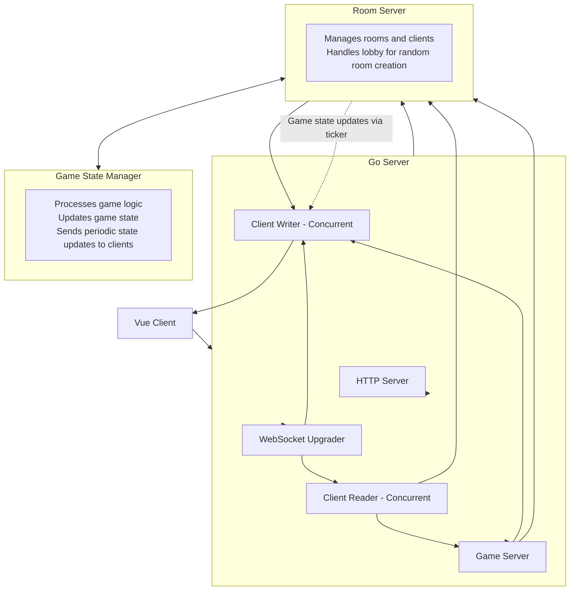

# WordsPlay

TinyWordGames is an engaging multiplayer word game that combines the thrill of real-time battles with the challenge of word creation. This project utilizes Golang for the backend server, Vue.js for the frontend application, WebSocket for real-time communication, and Docker for easy deployment.

## Tech Stack  
    	 

## Features

- **Real-time Battles:** Challenge your friends or random opponents to fast-paced word battles.
- **WebSocket Integration:** Enjoy seamless and instant communication between players for a responsive gaming experience.
- **Golang Backend:** Utilizes the power of Golang to handle server-side logic efficiently.
- **Vue.js Frontend:** A dynamic and interactive user interface designed with Vue.js for a smooth gaming experience.
- **Dockerized Multistaged Deployment:** Easily deploy and manage the application using Docker containers which are small and lightweight.

## SockIt

Wordsplay uses sockit package for better rooms, events and message [link](https://github.com/pregadez/sockit)

## Architecture  


## Project Setup
wordsplay uses Docker for deployment and project creation you can find docker-compose.yaml  in repo .

```
git clone git@github.com:pregadez/wordsplay.git
cd tinywordgames

docker-compose build
docker-compose up
```

## Authors

- [@Pragadeesh S.](https://www.github.com/pregadez)


